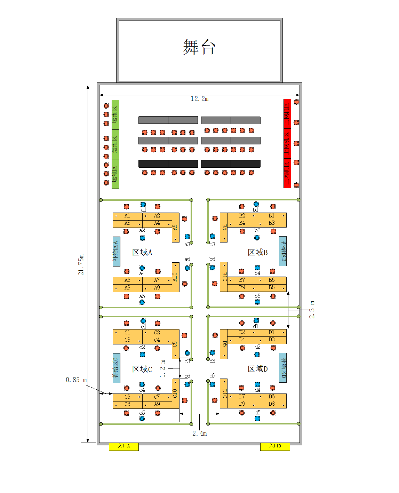
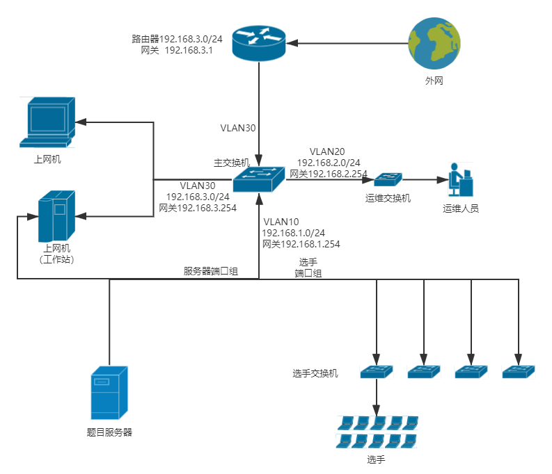
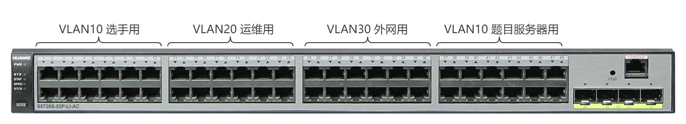
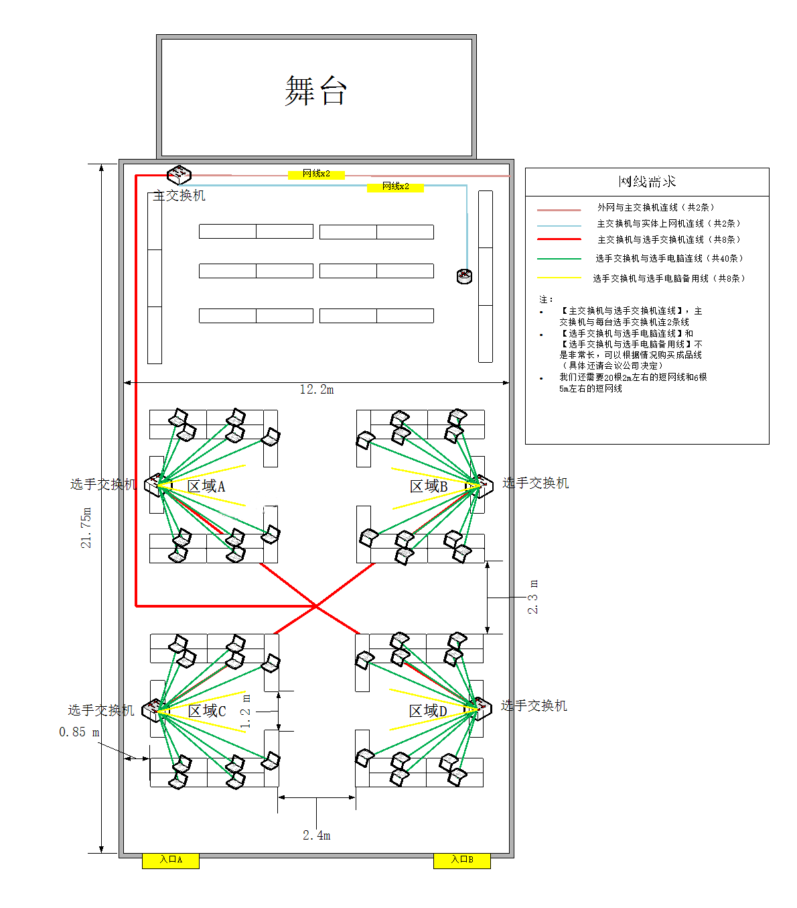
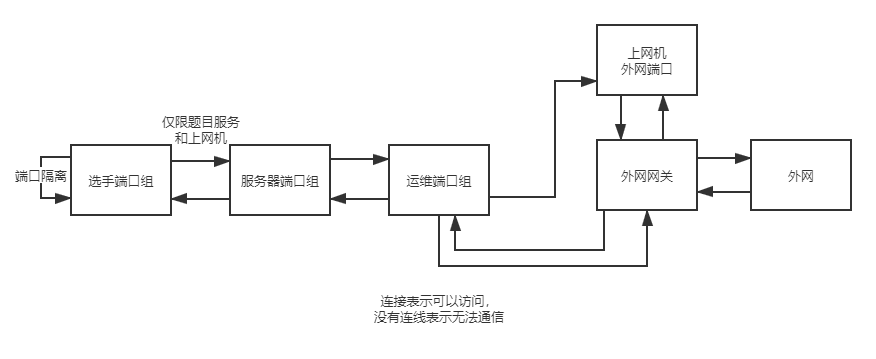

在 2021 年中学生网络安全竞赛工作人员的网络组做了一点网络拓扑规划和网络搭建的工作，总结记录一下。

<!-- more -->

## 硬件使用

服务器两台，主交换机一台，运维用交换机一台，选手用交换机四台，机架一个，UPS 两台，网线若干，16A 专用插排两个（UPS 使用），三芯 3\*2.5 电线 100 米

- 服务器：型号为 Huawei RH2288v3, E5‐xxxxv3, 128G ECC Memory, 600G*4 SAS HDD, 2*10Gbps 光口（未使用），2\*1Kbps 板载网卡，阵列卡一张，450W 电源
- 交换机：两台型号为 Huawei S5720‐52P‐LI‐AC，分别用作主交换机和运维用交换机；四台型号为 H3C LS-5024PV5-EI-PWR，用作选手交换机
- 服务器机架一个
- Console 线一根（或多根）
- 对讲机：摩托罗拉（Motorola）v168 对讲机 6 台
- 路由器：华硕（ASUS）RT‐AC86U 无线路由器 2900M 双频全千兆一台，用于外网访问配置回程路由以及负载均衡
- 网线、电源线、光纤跳线和插排若干

## 会场布置

主舞台在会场最前方，运维人员在会场左前方，外网和用于外网访问的上网机位于会场右前方，选手需要通过上网机访问外网。会场前方为嘉宾席，后方为选手比赛区域。选手比赛区域分成四个区域，共 40 个选手分成了 4 个区域，每个区域 10 人。4 台选手用交换机分别放在每个区域的补给区。详见下图。

## 供电相关

- 机柜、选手、交换机、现场大屏幕和运维人员分别请电工拉不同的电源线
- 提前计算服务器、交换机、选手、大屏幕和运维人员的大概功率，方便电工选择不同规格的电线，也方便我们购买插排
- 机架和交换机分别部署 UPS 和防电涌插排

## 软件环境

### 网络拓扑

使用了六台交换机，其中两台 48 口交换机分别用作主交换机和运维用交换机，其它四个 24 口交换机给选手使用。从外网的 VLAN 直接拉了两根网线用一个一分四的 TP-Link 小交换机给物理上网机做外网访问。

由于今年加入了外网访问，由于担心会场的路由器不能由我们配置，于是加了一台路由器做回程路由，实际上到会场后发现会场的路由器也是可以给我们配置的，不过这部分问题不大（虽然后来又发现会场垃圾的天翼网关没办法配置回程路由）。外网用两根网线接到路由器做了负载均衡用于提升外网访问速度。

### VLAN 划分

共划分了 3 个 VLAN，分别为 VLAN 10，VLAN 20 和 VLAN30。VLAN10 用于选手和题目服务器，VLAN20 用于运维人员，VLAN30 用于外网访问。每一组选手使用 VLAN10 中的上下两个端口，将上下两端口做链路聚合，接到选手用的交换机上，链路聚合起冗余和提速作用。VLAN20 接到运维用交换机，方便运维人员运维，也是上下两个端口做链路聚合。VLAN30 接入外网。

每个 VLAN 都启用了 VLANIF，并配置了默认网关为 254，使不同 VLAN 之间能够互相访问。之后再使用 ACL 去做 VLAN 间的访问控制。

### 网线布置

下图是实际会场的网线布置情况。

- 超五类网线
- 提前规划网线长度，让会议公司的工作人员做规定长度的网线
- 多拉几根备用的网线
- 网线检测仪（可以主机和从机分开在网线两端测试网线连通性）

### 访问控制

设置一些访问控制，以限制每部分的访问行为。

- 选手端口组之间设置端口隔离，使之两两不能访问，但能访问服务器和上网机。
- 选手仅限访问题目服务器和上网机，将选手到 VLAN20 和 VLAN30 的访问用 ACL 禁止，将上网机到运维的单向主动访问用 ACL 禁止，防止选手直接或通过上网机访问运维组，并防止选手不通过上网机直接访问外网。

### 赛前 check

有一份 SOP，但是没完全照着做，因为中间又临时改了好多东西（（（

## 一些值得注意的问题

- 交换机有 Web 配置界面，实在觉得命令行做某些操作太麻烦的时候去看一下 Web 配置页面可能会有意想不到的收获。
- 各种配置写完之后一定要记得保存，不要因为没找到保存的命令就默认它自动保存了。交换机的保存是退回用户视图执行 `save all` 命令。
- 配置写好但没有获得预期的结果的时候，首先检查各设备的电源是否打开，接线是否正确，**控制面板里的** Windows **网络**防火墙是否关闭，上网黑魔法是否关闭，可以解决大部分问题（实在不行可以用模拟器模拟一下再在实体设备上排查，可以解决绝大部分问题
- Less is more. 能用更简单的方法实现同样的功能就不要用麻烦的方法，否则出了问题解决起来更费事。
- 测线仪的主机和从机是能分开的（逃
- 机架里的网线用最短的 2 米线还是有点太长了，放到机架里还是有点混乱，还是自备几根更短一点的比较好。
- 抱着电脑去机柜连 console 线调试还是太傻了，为什么不用 telnet 呢...不要在这种基础的事情上犯懒否则后面都会很难做（
- 要提前和其它组的工作人员做好沟通，提前确定好一个正式的拓扑。今年感觉沟通没到位，现场改了一堆东西，最后有点混乱
- 比赛前一天调试的时候路由器出现经常断连几十秒又重连的情况。晚上没睡觉被叫起来调试了半天，把 DHCP 关掉就缓解了问题，实在是玄学。比赛到下午的时候突然出大问题。路由器直接 down 了，管理页面都进不去，重置重启也不管用，三个路由器有两个都出现了这种问题，幸亏还有一个备用的路由器，只能先拿来给外网访问用了，运维就缺了一个路由器用，最后还是回退到运维直接接交换机的那种最初构想的拓扑...后来就再也没出过问题。合理怀疑是那两个家用级路由器质量的锅。下次要用的话还是全部用企业级的东西稳妥，不管是去实验室借一个还是再去买都行啊，这种玄学问题实在是太难顶了（
