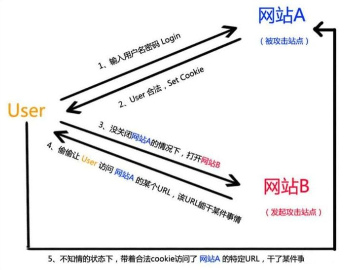
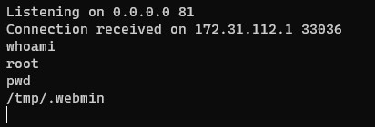

通过 CVE-2021-31760 对 CSRF 攻击做了一点更加深入的了解。

<!-- more -->

## CSRF 攻击的基本原理

**CSRF（Cross-site request forgery）** 的意思是跨站请求伪造，指的是伪造了客户端的身份，以客户端的名义执行请求。



如图，我们可以看到 CSRF 的基本要素有两个：

1. 用户登录受信任网站 A，并在本地生成 Cookie
2. 用户在不登出 A 的情况下打开攻击站点 B

其攻击成功的原理是， A 网站正常登陆后，cookie 正常保存，攻击站点 B 通过某种方式调用 A 网站接口进行操作，此时在请求 A 的接口时会自动带上 cookie。

这个攻击的完成需要同时满足以上的两个要素，看起来似乎条件比较苛刻，但是它既然能登上 OWASP 的 top 10，那这两个条件想必也并不是那么难以满足的。比如：

- 你不能保证你登录了一个网站后，不再打开一个 tab 页面并访问另外的网站。
- 你不能保证你关闭浏览器了后，你本地的 Cookie 立刻过期，你上次的会话已经结束。（由于关闭浏览器并不一定结束了一个会话）
- 上图中所谓的攻击网站，可能是一个存在其他漏洞的可信任的经常被人访问的网站。

这样看起来，给攻击站点好好包装一下，让它长得更加可信一点， CSRF 好像也没有那么困难（逃

## CVE-2021-31760 复现

### 漏洞简介

利用 CSRF 攻击通过 Webmin 的运行进程特性实现 RCE（远程命令执行）。

Webmin 是一个对系统情况进行图形化管理的 Web 端工具。该漏洞在 Webmin 1.973 之前的版本均有效。利用该漏洞可以使服务器反弹 Shell 并以此获得管理员权限，实现 RCE。

### 环境搭建

使用虚拟机在内网环境使用 docker 搭建服务。当然用公网也是可以的。配置如下：

```txt
Host: VMWare Ubuntu 20.04.3 LTS (192.168.110.105)
Docker: Docker CE 20.10.10 - CentOS 8
Webmin: Version 1.973 (192.168.110.105:10000)
Attacker: WSL2 Ubuntu 20.04 LTS (172.31.114.202)
```

将 docker 容器的 10000 端口映射到宿主机的 10000 端口，使得访问 192.168.110.105 的 10000 端口即可访问到容器内的 Webmin 服务。安装过程也很简单，在 sourceforge 下载 Webmin 源码后执行 `setup.sh` 即可。

### 恶意请求构造

在 Attacker 主机上起好 nginx 服务使之能够被访问后，运行 CVE 给到的 exp ,填写需要的信息，生成一份用于攻击 Webmin 的页面。


其实从这个 exp 的运行上来看，它的逻辑已经非常简单清晰了，不过我们也可以再拿它的源码来看一下它的运作过程。


可以非常明显地看到其主要逻辑就在这个 `CSRF_Generator()` 函数中，拿我们刚才填入的 target 信息和选择的反弹 shell 类型，去构建了一个可以提交 POST 表单的 CSRF 的页面，这个 POST 表单中的 cmd 字段就是构建的反弹 shell 的命令。由于有的服务器可能没安装某些语言，所以后边的几个弹 shell 的命令可能会失败...但是一般的服务器应该都有 bash 吧，所以选择第一个的 bash shell 是一般都能成功的。

之后在 Attacker 的本地开启 `nc` 监听一个特定的端口，当网站管理员点进了生成的恶意页面，就会将 cmd 提交到 Webmin 站点的 `/proc/run.cgi` 去执行，其中就包含了使用 `nc` 向 Attacker 反弹 shell 的逻辑。至此 Attacker 就将目标 getshell 了，之后也可以进行一些更加便于访问的操作，比如连个蚁剑什么的（

### 反弹 shell

这里我使用了 bash shell 的选项，在 Attacker 主机上监听了 81 端口。当管理员访问了我们的页面时，可以看到 Attacker 机上成功拿到了 Root 权限的 Shell。



## 一些其它问题

### 同源策略和 CSRF

在复现这个 CVE 的过程中产生了这样一个疑问：既然攻击者与目标机的域名是不一样的，浏览器为什么还会因为攻击者站点的跨域请求，将携带了 cookie 的 POST 请求发送到目标机呢？同源策略为什么没有对这个 CSRF 攻击产生限制？

#### 同源策略（SOP）

同源策略中的同源是指协议、域名、端口都一样。同源策略将不同源的各个服务隔离开，增加了安全性。之所以会遇到跨域问题，正是因为同源策略的各种限制。在不同的情况下，同源策略可能有不同的解释：

- 限制 cookies、DOM 和 JavaScript 的命名区域
- 限制 iframe、图片等各种资源的内容操作
- 限制 ajax 请求的响应结果

如果没有了 SOP：

- 一个浏览器打开几个 tab，数据就泄露了
- 用 iframe 打开一个银行网站，可以肆意读取网站的内容，获取用户输入的内容
- 更加肆意地进行 CSRF

#### 同源策略为什么不能防止 CSRF

根据我们前面对同源策略的解释发现，同源策略并没有限制使用 html tag 加载资源，而且它并不是阻止接口请求而是拦截请求结果，CSRF 恰恰占了这两个便宜。它可以使用 html tag 进行实现，并且反弹 shell 的操作对于是否返回请求结果并不重要，这使得同源策略无法有效防止 CSRF。

对于 GET 请求，直接放到 `` 就能神不知鬼不觉地请求跨域接口。对于 POST 请求，很多例子都使用 `<form>` 提交。归根到底，这两个方法不报跨域是因为请求由 html 控制，我们无法用 js 直接操作获得的结果。

不过同源策略并非完全没有作用。SOP 限制了 cookie 的命名区域，虽然请求会自动带上 cookies，但是攻击者无论如何还是无法获取 cookie 的内容本身。

### 防范方式

既然同源策略无法对 CSRF 进行有效的防范，那我们要防止 CSRF 就需要另辟蹊径。CSRF 的防御可以从服务端和客户端两方面着手，防御效果是从服务端着手效果比较好，现在一般的 CSRF 防御也都在服务端进行。服务端防御 CSRF 的基本思想是在 cookie 中增加伪随机数。

1. Cookie Hashing

   这种防范方法的思想非常简单。既然 CSRF 只是伪造用户请求而不能拿到用户的 cookie
   ，那么只要对 Cookie 进行一次 hash 计算，然后在服务器端验证这个 hash 值就好了。
   但是这种方式并非完美。由于用户的 Cookie 也可能由于网站的 XSS 漏洞被盗取，此时攻击者也可以轻易算出 Hash，所以综合来看这种简单的方法也存在一定的漏洞。

2. Authentication Code

   这种方式的思想也十分简单，用户每次提交表单都需要填写一个验证码，不过这种方式易用性并不太好，加重了用户的麻烦。好在可以完全解决 CSRF 的问题。

3. One-Time Tokens(不同的表单包含一个不同的伪随机值)

   一般通过 session token 来实现保护。当客户端请求页面时，服务器会生成一个随机数 Token，并且将 Token 放置到 session 当中，然后将 Token 发给客户端(一般通过构造 hidden 表单)。下次客户端提交请求时，Token 会随着表单一起提交到服务器端。接收到请求后，服务器端会对 Token 值进行验证，判断是否和 session 中的 Token 值相等，若相等，则可以证明请求有效，不是伪造的。由于攻击者服务器不能产生有效的 Token，直接对目标服务器进行请求势必不能通过验证，于是解决了 CSRF 的问题。
