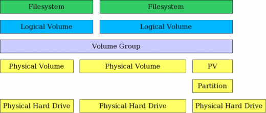
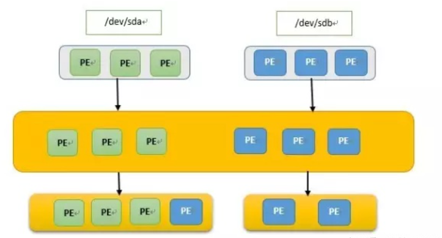
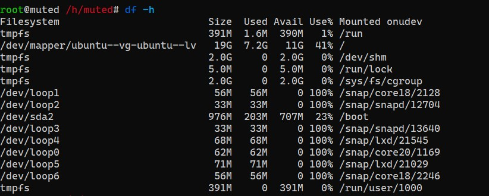
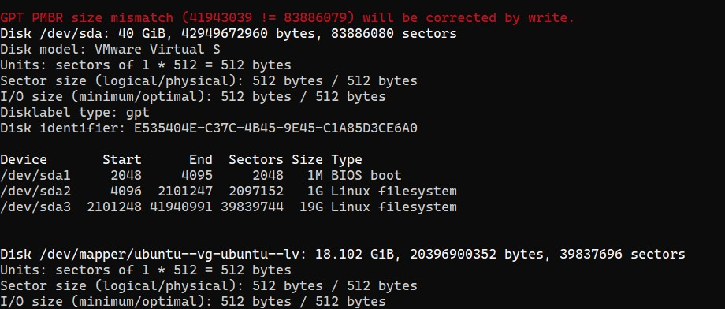
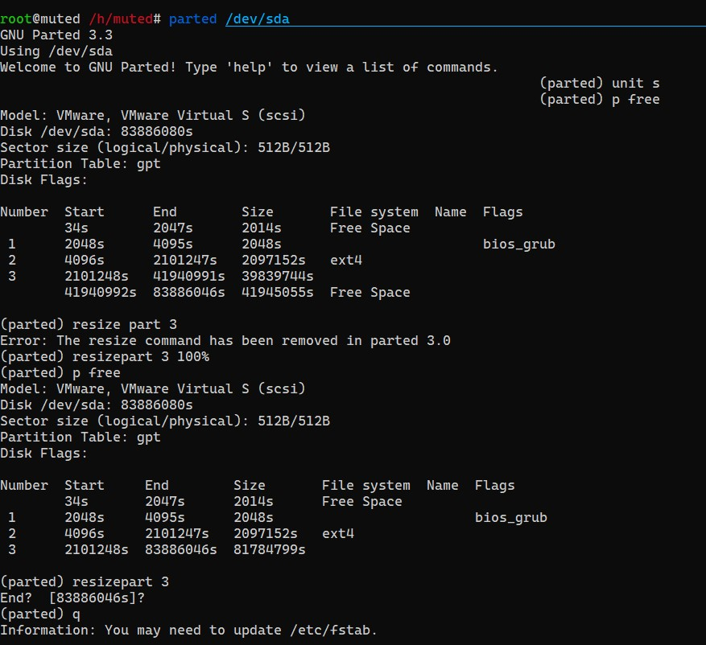
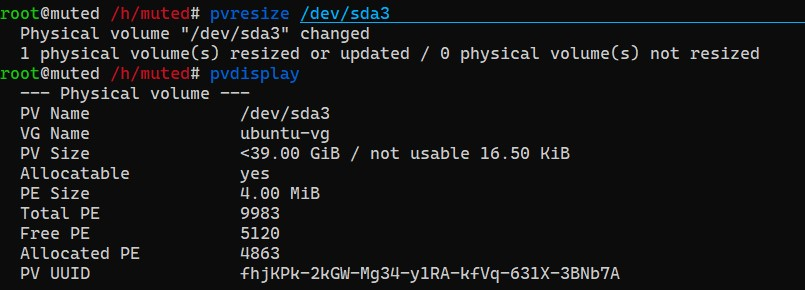
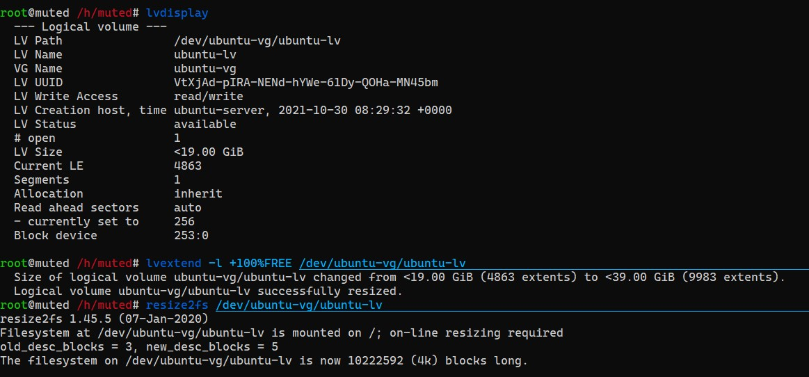

LVM（Logical Volume Manager），即逻辑卷管理器，对于硬盘管理来说是十分好用的，尤其是对于大容量存储设备的管理是有相当大的好处的。之前一直对这部分一知半解学了就忘，还是得记录一下。

<!-- more -->

## 驱动器、分区和卷

**驱动器（Drive）** 一般指的是用于存储的物理介质，如 HDD、SSD、U 盘等，在 linux 中表现为 `/dev` 目录下的各个设备节点，如 IDE 设备在 linux 中显示为 `/dev/hdX` ，其中 `X` 为字母，代表系统检测到设备的顺序，如第一块 IDE 设备即为 `/dev/hda` ，以此类推。类似地，SCSI 设备，现在也被广泛应用于各类 PATA 和 SATA 盘，在 linux 中显示为 `/dev/sdX` 。

驱动器可以被分为多个**分区（Partition）**，因此当我们谈论分区时，我们谈论的也是偏向物理层面的内容。每个分区在 linux 中的显示由其物理驱动器和编号组成，例如 `/dev/sda` 可能会有 `/dev/sda1`， `/dev/sda2` 等多个分区。分成分区后每个分区即可分别挂载到挂载点完成存储工作。也有一些类 Unix 系统采用诸如 `/dev/adX` （其中 `X` 为任意数字）的形式表示驱动器 X，并采用 `/dev/adXpY` （其中 `X` 和 `Y` 均为任意数字）来表示驱动器 X 的第 Y 个分区。不过总体上来看大同小异。

**卷（Volume）** 一般是在 LVM 管理中提到的概念。其中 **物理卷（Physical Volume）** 指的是整个驱动器或其中的某个分区，很明显是偏向物理层面的概念。而对比物理卷的概念，**逻辑卷（Logical Volume）** 则更偏向于逻辑层面。在 LVM 管理中，一个或多个物理卷可以被映射到一个或多个逻辑卷中，而上层应用与逻辑卷进行交互，从而对相应的物理卷中的存储单元产生读写等操作，极大地方便了存储空间的管理。

## 传统磁盘管理的局限性

在传统的磁盘管理中，磁盘被分为多个分区，并直接挂载到挂载点进行使用。每个分区的大小都是固定的，除非对硬盘进行重新分区，否则对分区的大小进行变更是很困难的，尤其是在生产环境中，如果因为这类原因导致服务 down 掉是绝对不能容忍的。LVM 是解决这一问题非常好的方式。

《程序员的自我修养》中引用过一段来源无从考证的名言：

> 计算机科学领域的任何问题都可以通过增加一个间接的中间层来解决。

感觉 LVM 就是在存储空间管理领域中对这句话的典型应用嘛...... 在传统的磁盘管理模式中，上层应用直接与物理存储介质交互，造成管理的不便和扩容的困难，既然如此，LVM 的方式就是在中间加入了一层中间层，将物理层面的存储介质和逻辑层面的存储设备隔离开，使得上层应用直接访问 LVM 的逻辑卷，并将要访问的逻辑卷的存储空间映射到物理存储介质上，从而巧妙地将逻辑层面上更换介质或扩充介质的问题与物理层面的分离，从而规避了物理存储管理的诸多问题。

## LVM 的原理



LVM 的工作原理中有以下几个重要的概念：

1. 物理卷（Physical Volume）
2. 卷组（Volume Group）
3. 逻辑卷（Logical Group）

这几个概念是伴随着 LVM 的原理产生的。LVM 对物理存储空间进行逻辑管理的过程有点像多线程与多核中的多对多关系，其具体过程如下：



1. 物理存储设备经过格式化形成物理卷。

   在这一步中物理存储设备将被分割成多个称为 PE（Physical Extent）的小单元，一般每个 PE 的大小为 4M，物理存储设备经过格式化分割后形成物理卷。

2. 创建卷组 VG（Volume Group）。

   在这一步中由上一步形成的物理卷组合形成卷组，以对不同卷组可以访问的物理介质范围进行限定。卷组可以从物理卷中的 PE 中任意挑选出若干块而形成。

3. 创建逻辑卷 LV（Logical Volume）。

   在这一步中我们从创建的 VG 中选取出若干 PE 组成一个 LV，在逻辑上，我们产生的 LV 和传统存储方法中的分区相类似，在经过挂载后都直接能和上层进行交互。不同之处是，我们的 LV 现在由多块 PE 构成，想要完成扩容等功能只需要对这些 PE 进行操作，而避免了物理设备层面上的诸多麻烦。

4. 将创建好的 LV 进行格式化后挂载使用。

## 实操

下面是对使用 LVM 的 Ubuntu 20.04.3 虚拟机进行扩容的实操步骤，在 VMWare 中进行扩容的操作在此略过。

1. 首先对系统的物理存储设备进行查看。

   ```bash
   df -h  # 查看已挂载的卷
   fdisk -l  # 查看物理存储设备情况

   # 发现报错 “GPT PMBR size mismatch (62914559 != 83886079) will be corrected by write.”
   parted -l  # 修复分区表
   ```

   
   

2. 使用 parted 给物理卷追加容量

   ```bash
   parted /dev/sda  # 对物理存储设备进行操作

   unit s  # 设置 Size 单位，方便追加输入
   p free  # 查看剩余容量详情
   resizepart 3 100%  # 将所有空闲空间都分配给 sda3
   # resizepart 3   也可以此命令之后输入结束位置
   q  # 退出
   ```

   

3. 更新 LVM 中的物理卷

   ```bash
   pvresize /dev/sda3  # 更新pv物理卷
   pvdisplay  # 查看状态
   ```

   

4. LVM 逻辑卷扩容

   ```bash
   lvdisplay  # 查看lv情况
   lvextend -l +100%FREE /dev/ubuntu-vg/ubuntu-lv  # 逻辑卷扩容
   resize2fs /dev/ubuntu-vg/ubuntu-lv  # 刷新逻辑卷
   ```

   