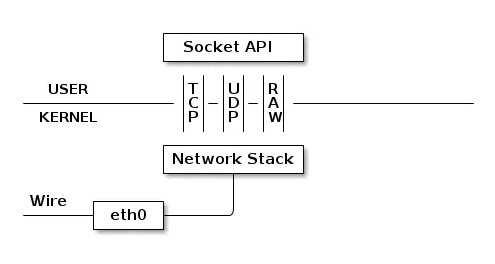
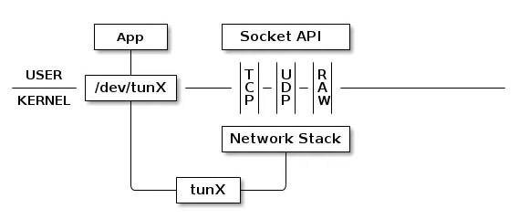
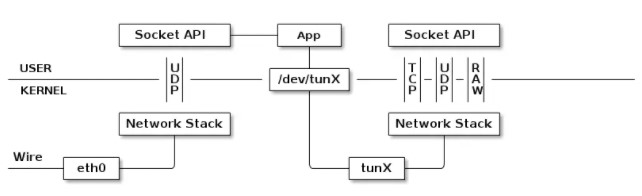

古人云：用 Clash 不用透明代理，就像四大名著不看红楼梦，说明这个人技术水平和自我修养不足，他理解不了这种内在的阳春白雪的高雅技术，他只能看到系统代理的堆砌，参不透其中深奥的精神内核，他整个人的层次就卡在这里了，只能度过一个相对失败的人生。

<!-- more -->

## 透明代理

透明代理的意思是客户端不需要知道有代理服务器的存在，它改变 request fields（报文）并传送真实 IP。本文中的透明代理是指使用 Clash 的 TUN 模式虚拟出来的一块 TUN 网卡，作为局域网中的网关，从而实现透明代理。

Clash 中的透明代理选项可以设置为使用 TAP 或 TUN 设备，它们的工作原理是相同的，区别在于 TUN 设备是一个三层设备，它只模拟到了网络层。我们可以通过 /dev/tunX 文件收发 IP 层数据包，它无法与物理网卡做 bridge，但是可以通过三层交换（如 ip_forward）与物理网卡连通。可以使用 ifconfig 之类的命令给该设备设定 IP 地址。而 TAP 设备是一个二层设备，它比 TUN 更加深入，通过 /dev/tapX 文件可以收发数据链路层的包，拥有 MAC 层功能，可以与物理网卡做 bridge，支持 MAC 层广播。同样的，我们也可以通过 ifconfig 之类的命令给该设备设定 IP 地址，我们也可以给它设定 MAC 地址。

关于为什么不使用系统代理而选择 TUN/TAP 透明代理，Clash For Windows 的官方文档给了这样一句话：

> 对于不遵循系统代理的软件，TUN 模式可以接管其流量并交由 CFW 处理，在 Windows 中，TUN 模式性能比 TAP 模式好。

## TUN

### TUN 的工作原理

我们使用物理网卡时网卡的工作过程如下图。在有线传输中，数据经过网卡接口 eth0 代表的物理网卡交给内核中的网络协议栈进行处理。对于错误的数据包，协议栈会选择丢弃；对于非本机的数据包，协议栈会选择转发；而对于传递给本机并且被上层需要的正确数据包，协议栈会通过 Socket API 交给用户层进行下一步处理。



使用 TUN 时的工作过程见下图。TUN 的工作过程和使用物理网卡是差不多的，tunX 是系统通过软件所模拟出来的一个虚拟网卡，它也代表了一个网络接口，和上面的 eth0 在逻辑上是等价的。使用 TUN 和直接使用物理网卡的区别在于，使用物理网卡时通过网线收发数据包，而 TUN 设备则是使用一个文件来收发数据包。



如图，网卡接口 tunX 所代表的虚拟网卡通过文件 /dev/tunX 与应用程序相连，应用程序每次使用 write 之类的系统调用将数据写入该文件，这些数据会以网络层数据包的形式，通过该虚拟网卡，经由网络接口 tunX 传递给网络协议栈，同时该应用程序也可以通过 read 之类的系统调用，经由文件 /dev/tunX 读取到协议栈向 tunX 传递的所有数据包。（一般这个 App 都会由连接了物理网卡和网络协议栈 Socket API 读写数据，其实也就相当于给普通的物理网卡加了一层中间层用来更改数据包实现代理嘛）

除此之外 TUN 设备和真正的物理网卡区别真的不大。协议栈可以像操纵普通网卡一样来操纵 tunX 所代表的虚拟网卡。比如说，给 tunX 设定 IP 地址，设置路由，总之，在协议栈看来，tunX 所代表的网卡和其他普通的网卡在逻辑上是一样的，当然由于 tunX 设备只模拟到网络层，所以不存在 MAC 地址。如果是 tapX 的话，在协议栈的眼中，tapX 和真实的网卡没有任何区别。

由于 TUN 就是和真实网卡在逻辑层面上相同的一个虚拟设备，所以我们可以完全不用触碰上层的任何东西，只是把物理网卡换成 TUN 设备就好了，由此可以非常优雅地实现透明代理。

下图是一个使用 TUN 设备做 UDP 透明代理的例子，方便更好地理解 TUN 到底是怎么工作的。我们可以清楚地看到，实际上就是将物理网卡工作的那张图从中间拆开，加了一层中间层而已。



### TUN 模式的两个协议栈

TUN 可以使用两个协议栈： system 和 gvisor。它们的区别在于，system 使用系统协议栈，提供了一个更加稳定全面的 x86/x64 TUN 体验，在理论上行为与系统的 TCP/IP 最接近，兼容性最强；而 gvisor 是一个用户态的网络协议栈，被用于有限延迟下的高频率交换。

使用 system 时需要注意给 clash 的 core 打开防火墙。

```txt
设置 - 更新和安全 - Windows 安全中心 - 防火墙和网络保护 - 允许应用通过防火墙 - clash-win64.exe - 专用/公用
```

### DNS 模式

Clash 中的 DNS 模式分为 redir-host 和 fake-ip 两种：

redir-host 首先查询不可信 DNS，如果返回了海外的 IP，则查询可信 DNS 并返回可信结果，如果返回国内 IP，就直接返回不可信结果。另外，此模式下所有的请求在转发时都发送 Host，而不是 IP，这样即使得到了污染 IP，远端仍然能解析出正确的 IP。

fake-ip 直接返回虚 IP，当收到代理请求时再让远端解析成正确 IP。

如果想要看更加详细的解释，可以参考[这里](https://blog.skk.moe/post/what-happend-to-dns-in-proxy/)。

当 enhanced-mode 设置为 fake-ip 时，会出现系统检测到网卡无法联网，微软系 APP 无法登陆使用等问题，可以通过添加 fake-ip-filter 解决：

```yaml
dns:
  enable: true
  enhanced-mode: fake-ip
  nameserver:
    - 114.114.114.114
  fake-ip-filter:
    - "dns.msftncsi.com"
    - "www.msftncsi.com"
    - "www.msftconnecttest.com"
```

综合来看，如果万年不重启 clash，那么 fake-ip 可能会更快一点，但是并没有和 redir-host 拉开质的差距。并且 redir-host 省心，而且不会有假 ip 污染 DNS 缓存的情况，所以综合来看我比较推荐使用 redir-host 模式。

### DNS 劫持

当处于 fake-ip 模式时，Clash 将始终为标准 DNS 查询返回一个假 IP。一些设备或软件总是使用一个硬编码的 DNS 服务器。(例如，谷歌音箱总是使用 8.8.8.8）。可以使用 dns-hijack 设置的地址来劫持查询，得到一个假 IP。而在 redir-host 模式下，clash 将返回一个由内部 DNS 服务器解析的结果。

Windows 下默认的这个 DNS 劫持地址为 198.18.0.2:53，而 Linux 则是 1.0.0.1:53。

## Clash 配置文件参考

使用 Clash For Windows 自带的 Mixin 功能向配置文件注入我们的设置。以下是配置参考，可能需要使用 Parser 对配置文件进行预处理，以使规则匹配到存在的策略组。

### Windows

```yaml
mixin:
  dns:
    enable: true
    enhanced-mode: redir-host
    nameserver:
      - 8.8.8.8 # 真实请求DNS，可多设置几个
      - 114.114.114.114
  # interface-name: WLAN # 出口网卡名称，或者使用下方的自动检测
  tun:
    enable: true
    stack: system # 使用 system 需要 Clash Premium 2021.05.08 及更高版本
    dns-hijack:
      - 198.18.0.2:53 # 请勿更改
    auto-route: true
    auto-detect-interface: true # 自动检测出口网卡

  rule-providers:
    reject:
      type: http
      behavior: domain
      url: "https://cdn.jsdelivr.net/gh/Loyalsoldier/clash-rules@release/reject.txt"
      path: ./ruleset/reject.yaml
      interval: 86400

    icloud:
      type: http
      behavior: domain
      url: "https://cdn.jsdelivr.net/gh/Loyalsoldier/clash-rules@release/icloud.txt"
      path: ./ruleset/icloud.yaml
      interval: 86400

    apple:
      type: http
      behavior: domain
      url: "https://cdn.jsdelivr.net/gh/Loyalsoldier/clash-rules@release/apple.txt"
      path: ./ruleset/apple.yaml
      interval: 86400

    google:
      type: http
      behavior: domain
      url: "https://cdn.jsdelivr.net/gh/Loyalsoldier/clash-rules@release/google.txt"
      path: ./ruleset/google.yaml
      interval: 86400

    proxy:
      type: http
      behavior: domain
      url: "https://cdn.jsdelivr.net/gh/Loyalsoldier/clash-rules@release/proxy.txt"
      path: ./ruleset/proxy.yaml
      interval: 86400

    direct:
      type: http
      behavior: domain
      url: "https://cdn.jsdelivr.net/gh/Loyalsoldier/clash-rules@release/direct.txt"
      path: ./ruleset/direct.yaml
      interval: 86400

    private:
      type: http
      behavior: domain
      url: "https://cdn.jsdelivr.net/gh/Loyalsoldier/clash-rules@release/private.txt"
      path: ./ruleset/private.yaml
      interval: 86400

    telegramcidr:
      type: http
      behavior: ipcidr
      url: "https://cdn.jsdelivr.net/gh/Loyalsoldier/clash-rules@release/telegramcidr.txt"
      path: ./ruleset/telegramcidr.yaml
      interval: 86400

    cncidr:
      type: http
      behavior: ipcidr
      url: "https://cdn.jsdelivr.net/gh/Loyalsoldier/clash-rules@release/cncidr.txt"
      path: ./ruleset/cncidr.yaml
      interval: 86400

    lancidr:
      type: http
      behavior: ipcidr
      url: "https://cdn.jsdelivr.net/gh/Loyalsoldier/clash-rules@release/lancidr.txt"
      path: ./ruleset/lancidr.yaml
      interval: 86400

  rules:
    - RULE-SET,lancidr,DIRECT # 局域网 ip -> DIRECT
    - RULE-SET,cncidr,DIRECT # cncidr -> direct
    - DOMAIN,msftconnecttest.com,DIRECT
    - PROCESS-NAME,v2ray,DIRECT
    - PROCESS-NAME,xray,DIRECT
    - PROCESS-NAME,naive,DIRECT
    - PROCESS-NAME,trojan,DIRECT
    - PROCESS-NAME,trojan-go,DIRECT
    - PROCESS-NAME,ss-local,DIRECT
    - PROCESS-NAME,privoxy,DIRECT
    - PROCESS-NAME,leaf,DIRECT
    - PROCESS-NAME,v2ray.exe,DIRECT
    - PROCESS-NAME,xray.exe,DIRECT
    - PROCESS-NAME,naive.exe,DIRECT
    - PROCESS-NAME,trojan.exe,DIRECT
    - PROCESS-NAME,trojan-go.exe,DIRECT
    - PROCESS-NAME,ss-local.exe,DIRECT
    - PROCESS-NAME,privoxy.exe,DIRECT
    - PROCESS-NAME,leaf.exe,DIRECT
    - PROCESS-NAME,Surge,DIRECT
    - PROCESS-NAME,Surge 2,DIRECT
    - PROCESS-NAME,Surge 3,DIRECT
    - PROCESS-NAME,Surge 4,DIRECT
    - PROCESS-NAME,Surge%202,DIRECT
    - PROCESS-NAME,Surge%203,DIRECT
    - PROCESS-NAME,Surge%204,DIRECT
    - PROCESS-NAME,Thunder,DIRECT
    - PROCESS-NAME,DownloadService,DIRECT
    - PROCESS-NAME,qBittorrent,DIRECT
    - PROCESS-NAME,Transmission,DIRECT
    - PROCESS-NAME,fdm,DIRECT
    - PROCESS-NAME,aria2c,DIRECT
    - PROCESS-NAME,Folx,DIRECT
    - PROCESS-NAME,NetTransport,DIRECT
    - PROCESS-NAME,uTorrent,DIRECT
    - PROCESS-NAME,WebTorrent,DIRECT
    - PROCESS-NAME,aria2c.exe,DIRECT
    - PROCESS-NAME,BitComet.exe,DIRECT
    - PROCESS-NAME,fdm.exe,DIRECT
    - PROCESS-NAME,NetTransport.exe,DIRECT
    - PROCESS-NAME,qbittorrent.exe,DIRECT
    - PROCESS-NAME,Thunder.exe,DIRECT
    - PROCESS-NAME,ThunderVIP.exe,DIRECT
    - PROCESS-NAME,transmission-daemon.exe,DIRECT
    - PROCESS-NAME,transmission-qt.exe,DIRECT
    - PROCESS-NAME,uTorrent.exe,DIRECT
    - PROCESS-NAME,WebTorrent.exe,DIRECT
    - DOMAIN,clash.razord.top,DIRECT
    - DOMAIN,yacd.haishan.me,DIRECT
    - RULE-SET,private,DIRECT
    - RULE-SET,reject,REJECT
    - RULE-SET,icloud,PROXY
    - RULE-SET,apple,DIRECT
    - RULE-SET,google,PROXY
    - RULE-SET,proxy,PROXY
    - RULE-SET,direct,DIRECT
    - RULE-SET,telegramcidr,PROXY
    - GEOIP,,DIRECT
    - GEOIP,CN,DIRECT
    - MATCH,PROXY
```

### Linux

```yaml
mixin: # object
  dns:
    enable: true
    enhanced-mode: redir-host
    nameserver:
      - 223.5.5.5
      - 8.8.8.8 # 真实请求DNS，可多设置几个
      - 114.114.114.114
  tun:
    enable: true
    stack: system # 使用 system 需要 Clash Premium 2021.05.08 及更高版本
    dns-hijack:
      - 1.0.0.1:53 # 请勿更改
```

需要注意的是，Linux 的 dns-hijack 地址和 Windows 不相同，而且 Linux 下一般不需要设置 interface-name 字段。

其它的 rule-provider 和 rules 配置与 Windows 相同，不再重复粘贴。
