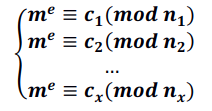
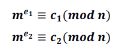
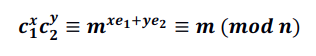
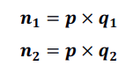
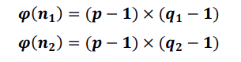
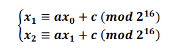
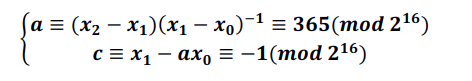

2021 密码学课程需要的作业。[代码](https://github.com/MUTED64/XDU_Crypto2021)放在 GitHub 仓库。

<!-- more -->

## 实验一

### 破解维吉尼亚密码

原理：使用暴力方式求解互重合指数，以此判断密钥长度，将维吉尼亚密码拆分成多个单表替换密码，对每个单表替换密码使用重合指数求替换表，最终获取维吉尼亚密码明文。

没什么好说的，放上密钥和明文：

```
Key is: b'\xba\x1f\x91\xb2S\xcd>'
Plain text is: Cryptography is the practice and study of techniques for, among other things, secure communication in the presence of attackers. Cryptography has been used for hundreds, if not thousands, of years, but traditional cryptosystems were designed and evaluated in a fairly ad hoc manner. For example, the Vigenere encryption scheme was thought to be secure for decades after it was invented, but we now know, and this exercise demonstrates, that it can be broken very easily.
```

### ReapeatingKeyXOR

原理：先计算汉明距离得到 29 为密钥长度，再进行异或解密。和上边的有一些部分是相似的，只不过判断密钥长度用了汉明距离，不算难。

```
密钥为：Terminator X: Bring the noise、
明文为：Plain text is: I'm back and I'm ringin' the bell
A rockin' on the mike while the fly girls yell
In ecstasy in the back of me
Well that's my DJ Deshay cuttin' all them Z's
Hittin' hard and the girlies goin' crazy
Vanilla's on the mike, man I'm not lazy.

I'm lettin' my drug kick in
It controls my mouth and I begin
To just let it flow, let my concepts go
My posse's to the side yellin', Go Vanilla Go!

Smooth 'cause that's the way I will be
And if you don't give a damn, then
Why you starin' at me
So get off 'cause I control the stage
There's no dissin' allowed
I'm in my own phase
The girlies sa y they love me and that is ok
And I can dance better than any kid n' play

Stage 2 -- Yea the one ya' wanna listen to
It's off my head so let the beat play through
So I can funk it up and make it sound good
1-2-3 Yo -- Knock on some wood
For good luck, I like my rhymes atrocious
Supercalafragilisticexpialidocious
I'm an effect and that you can bet
I can take a fly girl and make her wet.

I'm like Samson -- Samson to Delilah
There's no denyin', You can try to hang
But you'll keep tryin' to get my style
Over and over, practice makes perfect
But not if you're a loafer.

You'll get nowhere, no place, no time, no girls
Soon -- Oh my God, homebody, you probably eat
Spaghetti with a spoon! Come on and say it!

VIP. Vanilla Ice yep, yep, I'm comin' hard like a rhino
Intoxicating so you stagger like a wino
So punks stop trying and girl stop cryin'
Vanilla Ice is sellin' and you people are buyin'
'Cause why the freaks are jockin' like Crazy Glue
Movin' and groovin' trying to sing along
All through the ghetto groovin' this here song
Now you're amazed by the VIP posse.

Steppin' so hard like a German Nazi
Startled by the bases hittin' ground
There's no trippin' on mine, I'm just gettin' down
Sparkamatic, I'm hangin' tight like a fanatic
You trapped me once and I thought that
You might have it
So step down and lend me your ear
'89 in my time! You, '90 is my year.

You're weakenin' fast, YO! and I can tell it
Your body's gettin' hot, so, so I can smell it
So don't be mad and don't be sad
'Cause the lyrics belong to ICE, You can call me Dad
You're pitchin' a fit, so step back and endure
Let the witch doctor, Ice, do the dance to cure
So come up close and don't be square
You wanna battle me -- Anytime, anywhere

You thought that I was weak, Boy, you're dead wrong
So come on, everybody and sing this song

Say -- Play that funky music Say, go white boy, go white boy go
play that funky music Go white boy, go white boy, go
Lay down and boogie and play that funky music till you die.

Play that funky music Come on, Come on, let me hear
Play that funky music white boy you say it, say it
Play that funky music A little louder now
Play that funky music, white boy Come on, Come on, Come on
Play that funky music
```

### SHA1 破解

纯纯的暴力破解。每个按键只按了一次。逻辑并不难，但是需要跑挺久的。


## 实验二

### ECB 破解和 CBC 字节翻转

利用 CBC 的前一块密文与后一块明文 XOR 的特性实现字节翻转攻击。用了一种比较巧妙的方法。由于每次可以在秘密前加入特定数量的字节，可以逐字节将未知密文的最后一字节顶到下一块的第一字节，从而通过按字节的暴力破解来破解 ECB 模式的系统。这种方法比普通的暴力破解可以少用很多算力。

CBC 翻转可以通过添加 data 构造块，并异或这一块的某个字节。实际上，将这一块的现有字节异或下一块的对应字节并异或目的字节，将其填到这一块中覆盖现有字节，可以实现目的位的篡改。

代码和运行结果截图如下。


### AES MRZ

某民航电子护照的机器可读区域的破解，代码如下：


## 实验三

RSA 大礼包。题目附件给出了使用某 RSA 软件加密信息的逻辑，此 RSA 软件在设计中存在一定缺陷，如多次使用过小的 e、或产生的素数间存在相关性等，可能导致针对 RSA 的多种攻击，同时由于用户原因可能多次发送同样的明文加密的信息，使得该加密系统易被破解。题目给出了 21 个由此加密系统加密的帧，要求尽可能使用数学知识破解该 RSA 系统，获得明文及参数。

### RSA 广播攻击

如果有 x 条消息满足明文相同，指数相同且为 x，则可以列出下列方程组：



从而可以利用中国剩余定理解出$m^e$，开 e 次方根获得明文 m 的值。
在本题目中，满足条件的 e 可以为 3 或 5。e 为 3 的情况解出的 $m_3$ 不能找到 3 次方根，舍弃，e 为 5 的情况下可以使用 RSA 广播攻击正确解出明文。

### RSA 共模攻击

如果存在两条相同明文所产生的消息，其模数 n 相同，指数 e 互素，则可知：



则可以由扩展欧几里得定理构造 $xe_1+ye_2=1$，使得



从而获得明文 m。
在本题中，可以通过共模攻击获得第 0 和 4 帧的明文消息。

### 模公因子

如果 RSA 系统中一对消息的模数 $n_1,n_2$ 含有共同的因子 p，则可以将两模数进行素因子分解，即



从而获得两个帧中模数 n 的欧拉函数：



求 e 对 $\phi(n)$ 的逆，即可得到私钥 d，从而解密两条消息。在本题中可以通过公因子攻击解出帧 1 和帧 18 的消息和参数。

### 破解随机数发生器

从上面的共公因子攻击中，我们找到了由随机数发生器生成的素数 p。假设该随机数发生器采用的随机数产生方式是线性同余，且以 16bit 为单位，则通过对该素数 p 进行参数 a、c 的计算可以破解该随机数发生器的参数，从而采用该随机数发生器以暴力破解的方式获得其它帧的随机数。通过这种方式将暴力破解的随机数空间降低到了 16bit 的可接受范围内。

考虑线性同余随机数发生器 $x_n+1≡ax_n+c\ (mod\ m)$。

由于直接对该同余式进行求解，在 m 不确定的情况下存在解不唯一的情况，所以采用分组运算的方式，假设 m 为 $2^{16}$ 列出方程组并求解 a 和 c。即



上下两式相减，可得：



对于获得的 a 和 c 可以得到随机数发生器的全部参数后通过对随机数发生器
的初值进行暴力破解，验证通过随机数发生器产生的是否为帧中模数 N 的因
子，从而对 N 进行分解，得到 RSA 的所有参数。可得其中 16 个帧的 p 和 q 值。有了 p 和 q 即可方便地计算 $\phi(n)$，从而获得所有的参数，包括私钥 d 以及解密出的明文 x。其余的 5 个帧由于不是由 16bit 的整数倍构成的，对其进行生成后截取前 n 位进行破解，最终也能得到 N 的分解。或者去网上搜索已经获得的明文也是可以的。

最终可以由所有帧的参数获得最终的明文：

```
My secret is a famous saying of Albert Einstein. That is "Logic will
get you from A to B. Imagination will take you everywhere."
```
