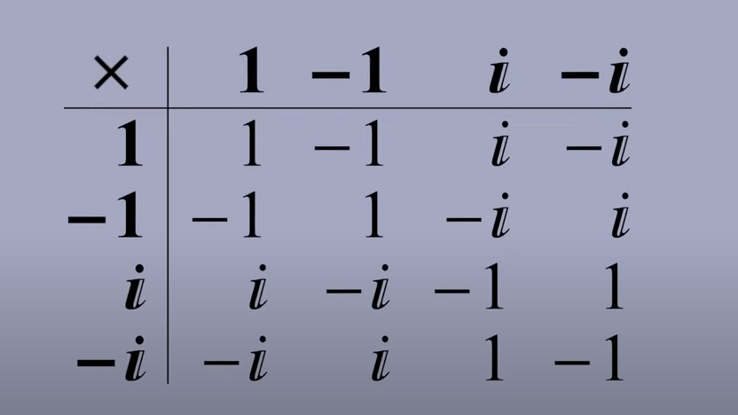
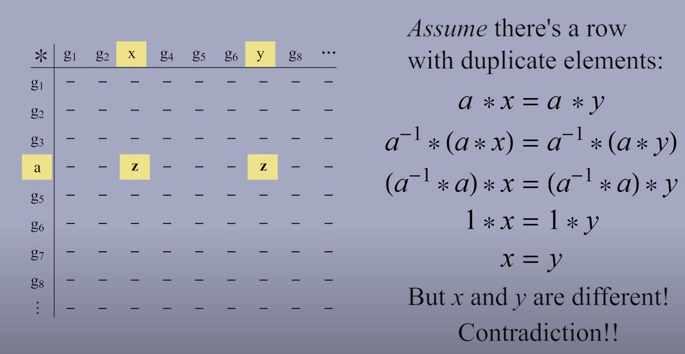
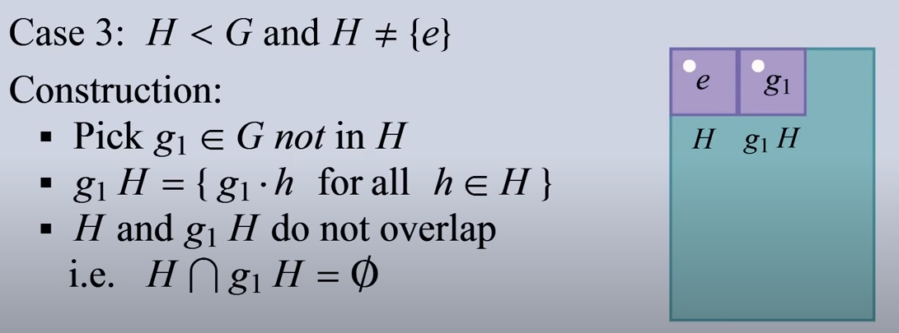
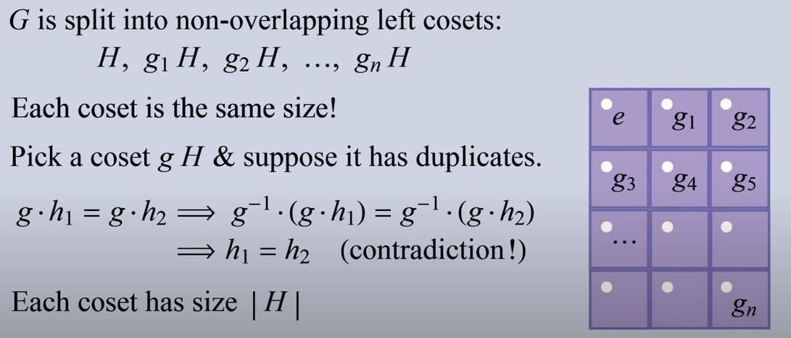
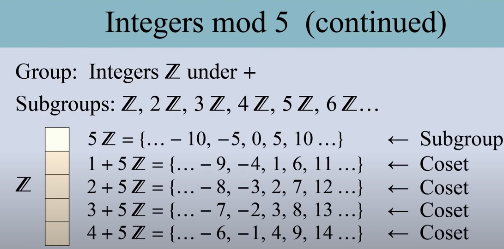
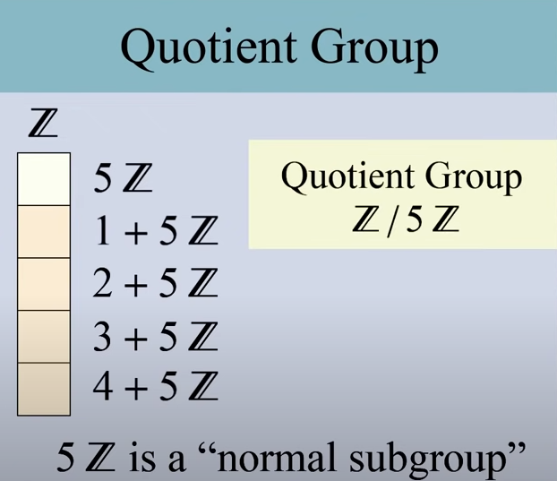
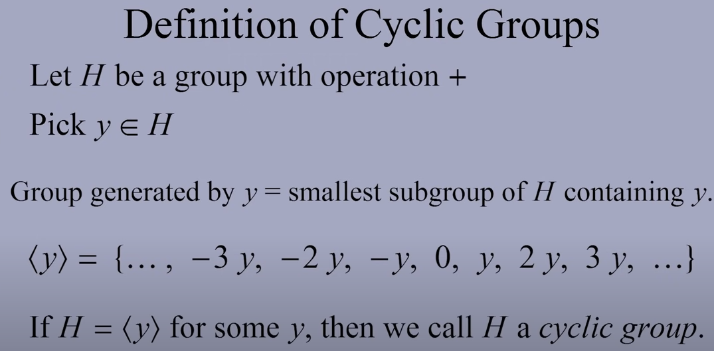
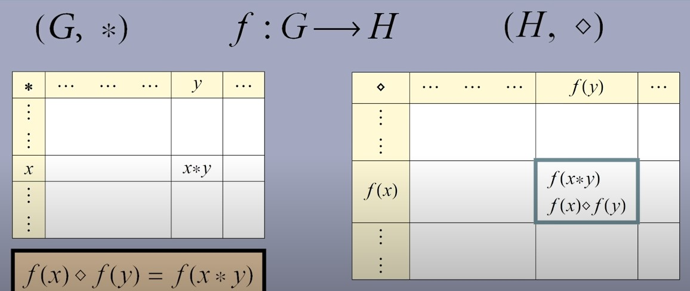
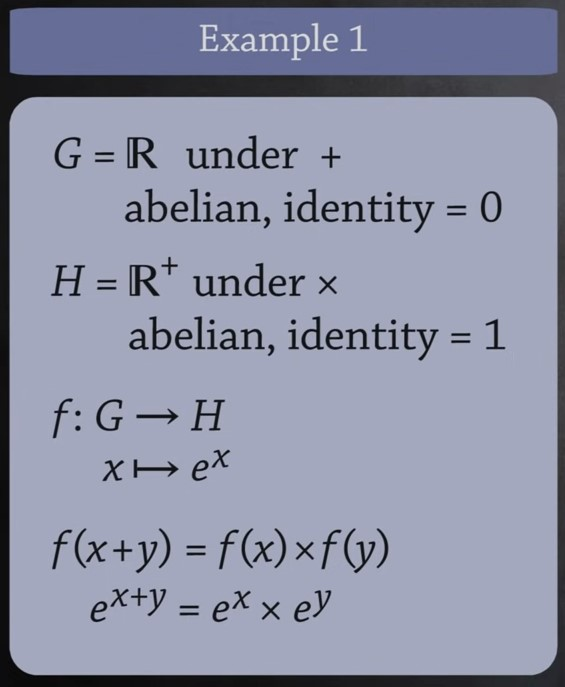

抽象代数学了好像没学，👴 要重学 😭（

为了方便理解有些部分可能写得并不是很严谨，不过对于理解抽象代数基本内容来说还是不错的。

Socratica 频道讲数学的女老师又温柔又可爱讲的又清楚 😭😭，我看爆，建议都去看（

<!--more -->

## 抽象代数

1800 年之后，人们发现他们使用相似的数学工具解决了几何，数论，拓扑，代数等诸多不同领域的问题。这引发了一个想法：将数学工具从具体的实际问题中间“抽象”出来，从而通过以一般的形式研究这个抽象后的数学工具来解决各类不同的具体问题。这导致了抽象代数这个领域的诞生。

经过时间的推移，人们从伽罗瓦、高斯以及其他人所使用的一些数学工具中“抽象”出一个通用的工具，进而研究它的一切，群论就此产生。

将这种思想运用到其它领域，又产生了多个其它的抽象对象，如：环（Rings），域（Fields），矢量空间（Vectors），模（Modules）等。这些抽象的对象共同构成了抽象代数这门学科。

## 群（Group）

“群”是抽象代数中及其重要的部分。由于其相对简单的定义，我们先从群入手去了解抽象代数的相关重要概念。

### 群的定义

一个群 G（指代 Group 的首字母）需要包含如下的要素：

- 一个元素（Element）的集合 G，元素可以不必是数字。
- 操作（Operation）： 可以记作 $+$，$×$，$*$ 等。
- 闭合性（Closed）： $x,y∈G \Rightarrow x*y∈G$
- 单位元 e（identity）： $y*e=e*y=y$
- 逆元（inverse）： 对于所有 G 中的 x 均存在逆元使得 $x*x^{-1}=e$
- 结合性（Associativity）： $a*(b*c)=(a*b)*c$

注意： 群中的运算不一定是可交换的，如果可交换，则称该群为交换（commutative）群或阿贝尔（Abelian）群。

> 为什么要这样定义群？
>
> 我们希望群的定义尽可能的简单。不过，如果我们希望使用抽象代数来解决问题，那么我们希望这个定义能够求解方程。对于方程的求解来讲所能限制到的最小条件就是我们对群的定义。想要了解更加详细的内容可以参见[Socratica 的这个视频](https://www.youtube.com/watch?v=yHq_yzYZV6U&list=PLi01XoE8jYoi3SgnnGorR_XOW3IcK-TP6&index=4)。

### 子群

我们可以定义一个群 G（Group）的一个子群 H（因为 H 是 G 的下一个字母）：群 H 的集合是群 G 集合的一个子集，不过 H 仍然是一个群。记作 $H \leq G$，读作 H 是 G 的子群。

> 子群 ： 子集 && 群

一些特殊的情况：

- $G \leq G$
- $\{e\} \leq G$，此时 $\{e\}$ 称为平凡群（Trivial Group）。
- 如果 $H \neq G$，那么 H 可以叫做 G 的真子群，记作 $H<G$

### 群乘法表

群乘法表（Group Multiplication Tables），也称作 Cayley 表，可以展示群中的运算的一些性质。

我们从一个四个元素的乘法群入手观察群运算的性质。

- 第一行第一列和表头是相同的，这是由于群中任何一个元素乘以这个群的单位元都是元素本身。
- 每行每列都有一个单位元，这是由于每个元素都存在一个逆元，而元素和逆元的乘积是单位元。
- 此乘法表关于斜对角线对称，这是因为此群是一个交换群。对于非交换群是不对称的。
- 每一行或每一列中都没有重复的元素。证明如下图。

### 拉格朗日定理

为了研究一个群，我们可以从它的子群来入手。但是我们从哪里开始寻找子群呢？答案是，可以使用拉格朗日定理。拉格朗日定理揭示了群和它的子群间的大小关系，通过拉格朗日定理，我们可以显著缩小可能的子群的范围。

拉格朗日定理说的大致意思就是：一个群的阶（Order，即群中元素的个数）可以被这个群的子群的阶整除。

$$
Order\ of\ G = \#\ of\ elements\ in\ G = |G|
$$

$$
H \leq G \Rightarrow |H|\ divides\ |G|
$$

拉格朗日定理可以极大地缩小子群的范围。举个例子，我们要找一个阶是 323 的 G 的子群。由于 $323=17\times19$，所以可能的子群的阶只有 1,17,19 和 323。

> 注意： 拉格朗日定理并没有说一定存在阶为 17 或 19 的子群。拉格朗日定理只是说，如果这个群存在除了 $\{e\}$ 和 G 之外的子群，那么子群的阶必定为 17 或 19。

拉格朗日定理的证明需要用到陪集（coset）的概念。我们接下来看一下拉格朗日定理的证明，不想看证明的可以跳过...

我们设 G 是阶为 n 的有限群。

1. 对于 H = {e}，显然是成立的。
2. 对于 H = G，显然也是成立的。
3. 对于这两种之外的情况，我们需要构造陪集来说明。

陪集的构造也是很简单的，如图所示，我们找到一个不在 H 中的元素 $g_1$，用它和 H 中所有的元素 h 相乘，构成的集合就是陪集。注意陪集只是一个集合而不是群，因为陪集中没有单位元。

陪集的一个非常非常重要性质就是：陪集和 H 之间不重叠，陪集和陪集之间也互不重叠。如果想了解更加详细的证明，可以参考[这个视频](https://www.youtube.com/watch?v=TCcSZEL_3CQ&list=PLi01XoE8jYoi3SgnnGorR_XOW3IcK-TP6&index=7)。

还有一个重要的性质：所有陪集的大小都是相等的，都等于 H 的阶
。这点我们可以通过说明陪集中不存在重复的元素来证明。

既然我们证明了陪集互不重叠且大小相等，那么我们知道，H 和它的陪集在一起可以填满整个 G（如图所示），也就是说，G 中的元素个数是 H 中元素个数的整数倍。至此，我们可以说明拉格朗日定理 $|H|\ divides\ |G|$。

非交换群中左陪集和右陪集是不同的，但是如果要证明拉格朗日定理的话，左陪集和右陪集过程类似。我们都是通过证明陪集间不重叠且大小相等，让陪集填满整个 G，从而证明拉格朗日定理的。

### 正规子群和商群

正规子群 N（Normal Subgroup）和普通的子群的区别，简单来说就是它可以和它的陪集一同构成一个新的群。这个构成的新群中的元素和原来的群完全不同，它的元素是正规子群（可以看成是和 e 做运算的陪集）和它的所有陪集。这个形成的新群就叫做商群（Quotient Group）。（或者叫 Factory Group）

举例来说，我们使用在整数上定义的加法群 Z，那么 5Z 是 Z 的一个子群，于是我们可以找到另外的几个陪集。

由于 5Z 和它的几个陪集可以形成一个加法群，它们的运算如 (2+5Z) + (4+5Z) = 1+5Z。由这五个陪集所构成的群就叫做商群，记作了 Z/5Z。其中的 Z 代表原来的群，而 5Z 代表了构成商群的正规子群，Z/5Z 是一个元素全都是陪集的群。

### 商群的要素

商群既然称为群，那么群的要素也是齐全的。我们可以看到：

- 商群由陪集构成，在运算上确实是闭合的。
- 商群的运算和原来的群是相同的，只不过是在陪集上对每一个元素都可以进行这样的运算，可以以陪集的代表元为代表来运算。
- 单位元： 构成这个商群的正规子群（N）。
- 逆元： 陪集 $yN$ 的逆元是 $y^{-1}N$。
- 结合律也是成立的。

对于证明，有兴趣的读者可以参考[这个视频](https://www.youtube.com/watch?v=vYKdh5oQ4Zw&list=PLi01XoE8jYoi3SgnnGorR_XOW3IcK-TP6&index=8)。

### 正规子群的性质和判定

并不是所有的子群都是正规子群。有些子群和它的陪集是不能构成一个群的。一个是正规子群的条件是：

对于所有的 $y∈G$，都有 $y^{-1}Ny=N$。

反过来也是成立的。如果满足了这个条件，那么这个子群就是正规子群，记作 $N \unlhd G$。

证明同样可以参考上面的那个视频。

### 简单群

我们知道，群至少会有两个子群。一个是由单位元构成的群，一个是它自身。我们成只有这两个子群的群为简单群（Simple Group）。

不觉得这个说法很像素数嘛？素数就是因子只有一和它自身的数嘛。实际上，简单群在群中的地位就像素数在数论中的地位一样，我们可以用它们来构建其它的群。

### 循环群

如果一个群是由一个元素“生成”的，那么我们称这个群为循环群（Cyclic Group）。我们看下图的例子：

一个群，例如加法群，必然包括单位元，生成元素，以及生成元素的逆，以及由这三个元素生成的其它元素。上图展示了一个无限循环群。

那么为什么要叫循环群呢？其实在无限循环群上不是太明显，在有限循环群中体现的比较明显。有限循环群实际上是在无限循环群中取了模，例如模 n 的有限循环群会在 0 到 n-1 之间不停地循环。其它的特性是相似的。我觉得实际上可以把无限循环群想成循环周期为无穷的一个循环群（

循环群包括了有限循环群、无限循环群和平凡群。

一个称为“有限生成阿贝尔群基本定理”（The Fundamental Theorem of Finitely Generated Abelian Groups）的定理说，任何有限生成的阿贝尔群都可以分解为有限数量的循环群。每个循环群要么是整数，要么是整数 mod n，所以循环群是有限生成阿贝尔群的基本构建块。

### 群的同态

有些群之间可能有某些相似性。我们如何来判断这种相似性呢？答案是：同态（Homomorphism）。"Homo"的意思是同质的，"Morph"的意思是结构，将它们组合起来我们可以理解群同态的意思是，“两个群的结构是具有同质性的”。同态可以判断两个群之间相似性。它是从其中一个群到另一个群的映射，它同时保留了这两个群的结构。下面我们来说明同态是怎么定义的。

比如，我们有一个群 G，它的运算是 $*$，还有一个群 H，它的运算是 $\diamond$。我们想要判断它们之间的相似性。

我们取 $x,y \in G$，并且 $x * y = z$。为了说明 $G$ 和 $H$ 之间的同态关系，我们想要定义一个从 $G$ 到 $H$ 的映射 $f$，即 $f:G\rightarrow H$，使得 $f(x) \diamond f(y) = f(z)$，也就是说要使 $f(x),f(y)$ 在 $H$ 中的表现和 $x,y$ 在 $G$ 中的表现是相似的。

既然我们又知道 $z=x*y$，那么我们就可以推出 $f(x) \diamond f(y) = f(x*y)$，这就是群同态的定义。我们可以通过下图很直观地看出同态的定义。

我们可以举个例子，如下图，我们可以看到加法和幂乘运算是同态的。

### 群的同构

群的同态揭示了群之间的相似性。那么有没有两个群的表现是相同的呢？有的。和群的同态类似，它叫做群的同构（Isomorphism）。

群同态和群同构实际上是挺像的。只不过同构中有两个条件同态可以不用满足：

- 同构中 f 是单射（一对一的）。同态可以不必满足，在同态中可以有多个 G 中的元素映射到一个 H 中的元素。
- 同构中 f 是满射，也就是说 H 中的所有元素都有 G 中的元素与之对应。而同态可以不必满足。

因此在同构中我们有了 $f$ 也就有了 $f^{-1}$，这个映射的过程是可逆的。我们也可以说，同构就是一个双射的同态。

### 群中元素的阶

群的阶我们前边已经说过，就是群中元素的个数。那么群中元素的阶又是什么呢？它和群的阶又有什么关系？

实际上，群中元素 a 的阶（Order）是使得 $a^n=e$ 成立的最小的正整数 n。它的记法和群的阶也是一样的： $|a|=n$，只不过 $|\ |$ 中间是元素而不是群。

对于有限群来说，所有群中元素的阶的最大值实际上就是群的阶，这给了我们群的阶的另一种理解方式。对照上面说过的 Cayley 表的性质还是很好理解的。对于无限群来说，群的阶是不存在的，实际上就是无限群中有的元素不论和自己进行多少次运算也不会得到 e。

### 对称群

首先注意，对称群（Symmetric Group）和空间对称群（Symmetry Group）是不同的东西。对称群的元素是置换，而空间对称群的元素是对二面体的旋转 r 和翻转 f。
